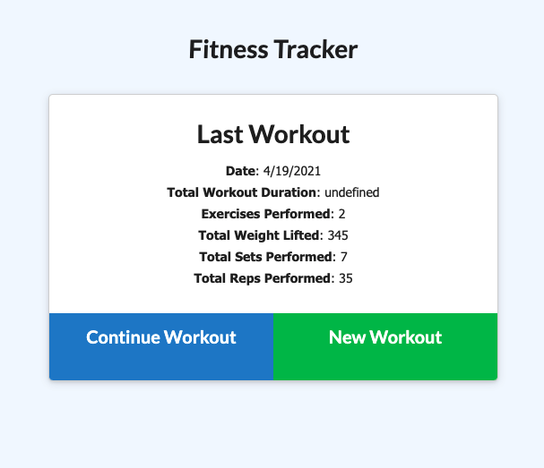
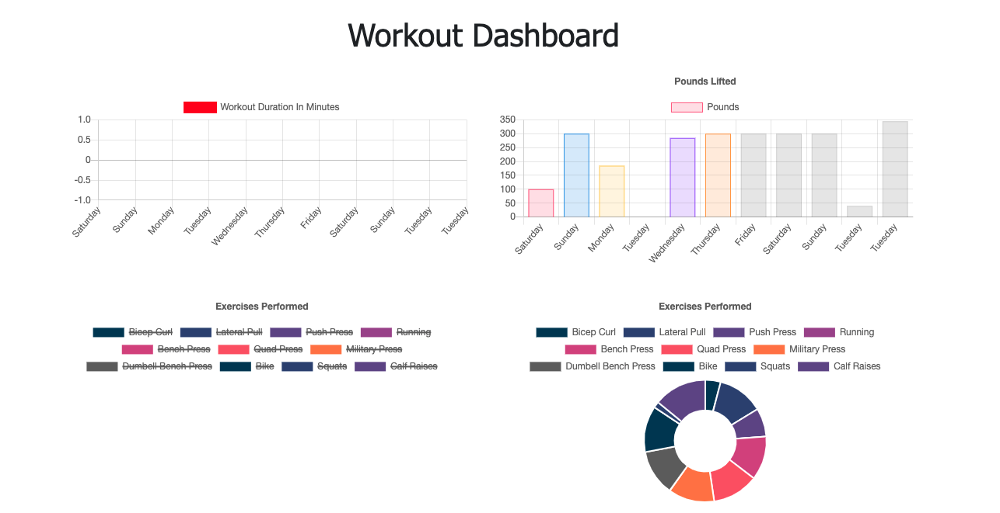

# Fitness-Tracker

   

  ## Table of Contents
  * [Task](#task)
  * [Preview](#preview)
  * [Thoughts](#thoughts)
  * [Technologies Used](#technologies)
  * [Links](#links)

## Task :man_technologist:
For this assignment, we were tasked with creating a fitness tracker application that is deployed through Heroku. A user is able to create a workout to be tracked with the 'Create Workout' button. Once clicked, the user is taken to a page where they can input the excericises done and details such as, duration, reps, weight, distance, etc. On the hompage, the 'Dashboard' link carries the user to a graph displaying the exercises done with metrics that are tracked each day the user inputs information. [Deployed Application](htpps://witness-fit.hrokuapp.com)

## Preview

Last Workout Image  

Stats Image

## Thoughts :thinking:
I thought this was a pretty cool application to build out (probably becuase most of it was built out already lol). I really like how the graph populates with the user information.

## Technologies Used
Languages: Javascript

Packages: express, mongoose, path

## Links
Repo: https://github.com/uzobeki/Fitness-Tracker 
Deployed App: https://witnes-fit.herokuapp.com

## Author
Uzochukwu Obeki